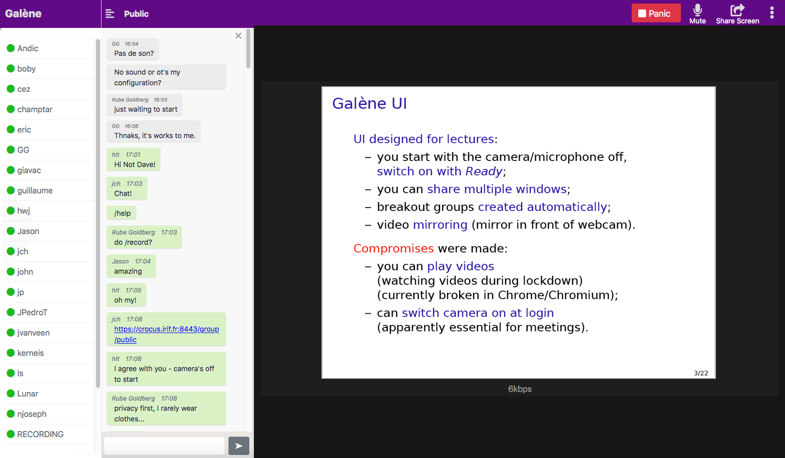

# Galène pour YunoHost

[](https://dash.yunohost.org/appci/app/galene)    
[](https://install-app.yunohost.org/?app=galene)

*[Read this readme in english.](./README.md)* 

> *Ce package vous permet d'installer Galène rapidement et simplement sur un serveur YunoHost.  
Si vous n'avez pas YunoHost, consultez [le guide](https://yunohost.org/#/install) pour apprendre comment l'installer.*

## Vue d'ensemble
Galène est un serveur de visioconférence facile à déployer (il suffit de copier quelques fichiers et d'exécuter le binaire) et qui nécessite des ressources serveur modérées. Il a été conçu à l'origine pour les conférences (où un seul orateur diffuse l'audio et la vidéo à des centaines ou des milliers d'utilisateurs), mais a ensuite évolué pour être utile pour les travaux pratiques des étudiants (où les utilisateurs sont divisés en plusieurs petits groupes) et les réunions (où un quelques dizaines d'utilisateurs interagissent les uns avec les autres).

**Version incluse :** 0.3.2

## Captures d'écran



## Démo

* [Démo officielle](https://galene.org:8443/)

## Configuration

### Comment créer des groupes

Les groupes sont définis par des fichiers dans le répertoire `/opt/yunohost/galene/groups`. Différentes options sont disponibles (voir https://github.com/YunoHost-Apps/galene_ynh/wiki/Configuration-file)

## Documentation

 * Documentation officielle : https://galene.org/
 * Documentation YunoHost : https://yunohost.org/fr/app_galene

## Caractéristiques spécifiques YunoHost

#### Support multi-utilisateur

* L'authentification LDAP est-elle prise en charge ? **Non**
* L'application peut-elle être utilisée par plusieurs utilisateurs ? **Oui**

#### Supported architectures

* x86-64 - [](https://ci-apps.yunohost.org/ci/apps/galene/)
* ARMv8-A - [](https://ci-apps-arm.yunohost.org/ci/apps/galene/)

## Limitations

* Limitations connues.

## Informations additionnelles

* Autres informations que vous souhaitez ajouter sur cette application.

## Liens

 * Signaler un bug : https://github.com/YunoHost-Apps/galene_ynh/issues
 * Site de l'application : https://galene.org/
 * Dépôt de l'application principale : https://github.com/jech/galene
 * Site web YunoHost : https://yunohost.org/

---

## Informations pour les développeurs

Merci de faire vos pull request sur la [branche testing](https://github.com/YunoHost-Apps/galene_ynh/tree/testing).

Pour essayer la branche testing, procédez comme suit.
```
sudo yunohost app install https://github.com/YunoHost-Apps/galene_ynh/tree/testing --debug
ou
sudo yunohost app upgrade galene -u https://github.com/YunoHost-Apps/galene_ynh/tree/testing --debug
```
