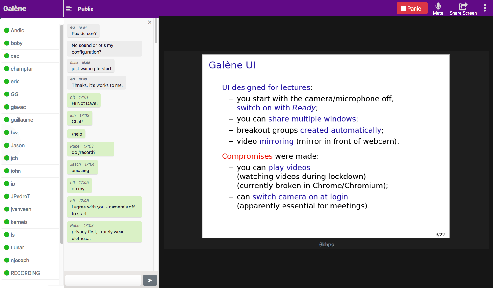

<!--
N.B.: This README was automatically generated by https://github.com/YunoHost/apps/tree/master/tools/README-generator
It shall NOT be edited by hand.
-->

# Galène pour YunoHost

[](https://dash.yunohost.org/appci/app/galene)  
[](https://install-app.yunohost.org/?app=galene)

*[Read this readme in english.](./README.md)*

> *Ce package vous permet d’installer Galène rapidement et simplement sur un serveur YunoHost.
Si vous n’avez pas YunoHost, regardez [ici](https://yunohost.org/#/install) pour savoir comment l’installer et en profiter.*

## Vue d’ensemble

Galène est un serveur de visioconférence (un « SFU ») facile à déployer et qui nécessite des ressources serveur modérées. Il a été conçu à l'origine pour les cours et les conférences (où un seul orateur diffuse de l'audio et de la vidéo à des centaines ou des milliers d'utilisateurs), mais a évolué par la suite pour être utile pour les travaux pratiques des étudiants (où les utilisateurs sont divisés en plusieurs petits groupes) et les réunions (où un douzaine d'utilisateurs interagissent entre eux).

### Fonctionnalités client :

- audio et vidéo multipartites
- chat textuel
- assez bonne prise en charge pour mobile (Android et iPhone/iPad)
- partage d'écran et de fenêtre, y compris le partage de plusieurs fenêtres simultanément (pas sur mobile)
- streaming vidéo et audio à partir du disque
- détection d'activité
- prise en charge LDAP


**Version incluse :** 0.6.1~ynh4

**Démo :** https://galene.org:8443/

## Captures d’écran



## Avertissements / informations importantes

### Accéder à des groupes

Les salles de réunion *Galène* sont appelées « groupes ». Tout groupe est accessible sur `https://domain.tld/group/GroupName`, en tapant son nom dans le champ de recherche de la page d'accueil, ou en le sélectionnant dans la liste publique (si le groupe est configuré comme visible publiquement, voir ci-dessous).
Pendant l'installation, un groupe est créé avec l'authentification LDAP de YunoHost, accessible à `https://domain.tld/group/YunoHost_Users`.

#### Ajouter et configurer des groupes

Les groupes sont définis par des fichiers JSON situés dans le dossier `/home/yunohost.app/galene/groups`. Chaque groupe est représenté par un fichier `GroupName.json`.
Pour créer un nouveau groupe, vous devez créer un fichier `GroupNameExample.json` et redémarrer le service Galène (vous pouvez également créer un sous-dossier, et les groupes seront accessibles avec` https://domain.tld/group/subfolder/GroupName/`). Différentes options de configurations sont disponibles (voir https://github.com/YunoHost-Apps/galene_ynh/wiki/Configuration-file).

*NB : Les espaces sont pris en charge dans les noms de fichiers de groupe.* 

Lorsque Galène est supprimé, le répertoire de données (`/home/yunohost.app/galene/`) est conservé. Si vous souhaitez le supprimer avec Galène, utilisez l'option `--purge` : `sudo yunohost app remove galene --purge`. 

### Configurer votre serveur TURN

#### Utilisation du serveur TURN de *Galène*
Galène est livré avec un serveur TURN intégré qui devrait fonctionner immédiatement.
- Si votre serveur est derrière NAT, autorisez le trafic entrant vers le port TCP/UDP `1194` (ou tout ce qui est configuré avec l'option `-turn` dans `/etc/systemd/system/galene.service`)

#### Utilisation de votre propre serveur TURN
- Installez [coturn_ynh](https://github.com/YunoHost-Apps/coturn_ynh).
- Ajoutez `/var/www/galene/data/ice-servers.json` avec ces lignes et changez `turn.example.org` et `secret`

```
    [
        {
            "urls": [
                "turn:turn.example.org:5349",
                "turn:turn.example.org:5349?transport=tcp"
            ],
            "username": "galene",
            "credential": "secret"
        }
    ]
``` 
- Dans `/etc/systemd/system/galene.service` changer l'option `-turn auto` (ou `-turn ""` pour désactiver le serveur TURN intégré). 

Pour vérifier si le serveur TURN est opérationnel, tapez `/relay-test` dans la boîte de dialogue du chat de *Galène* ; si le serveur TURN est correctement configuré, vous devriez voir un message indiquant que le test du relai a réussi.

Vous pouvez également installer *Galène* avec un serveur TURN externe avec cette branch : https://github.com/YunoHost-Apps/galene_ynh/tree/galene+turn

### Statistiques du serveur

Les statistiques sont disponibles sous `/opt/yunohost/galene/stats.json`, avec une version lisible sur `domain.ltd/stats.html`. Cette page n'est disponible que pour l'administrateur du serveur (le mot de passe et l'administrateur sont définis dans le fichier `config.json` : `/opt/yunohost/galene/data/config.json`).

### Comment enregistrer ma conférence ?

Assurez-vous que l'autorisation d'enregistrement est définie dans la configuration de votre groupe. Connectez-vous en tant qu'opérateur, puis dites `/record` dans la fenêtre de chat avant de commencer la visio. N'oubliez pas de dire `/unrecord` à la fin. Vous trouverez vos enregistrements sous `https://server.example.com/recordings/groupname/`. Les enregistrements vidéo sont stockés dans le dossier `/home/yunohost.app/galene/recordings`. 

## Documentations et ressources

* Site officiel de l’app : <https://galene.org/>
* Documentation officielle utilisateur : <https://galene.org/faq.html>
* Documentation officielle de l’admin : <https://galene.org/>
* Dépôt de code officiel de l’app : <https://github.com/jech/galene>
* Documentation YunoHost pour cette app : <https://yunohost.org/app_galene>
* Signaler un bug : <https://github.com/YunoHost-Apps/galene_ynh/issues>

## Informations pour les développeurs

Merci de faire vos pull request sur la [branche testing](https://github.com/YunoHost-Apps/galene_ynh/tree/testing).

Pour essayer la branche testing, procédez comme suit.

``` bash
sudo yunohost app install https://github.com/YunoHost-Apps/galene_ynh/tree/testing --debug
ou
sudo yunohost app upgrade galene -u https://github.com/YunoHost-Apps/galene_ynh/tree/testing --debug
```

**Plus d’infos sur le packaging d’applications :** <https://yunohost.org/packaging_apps>