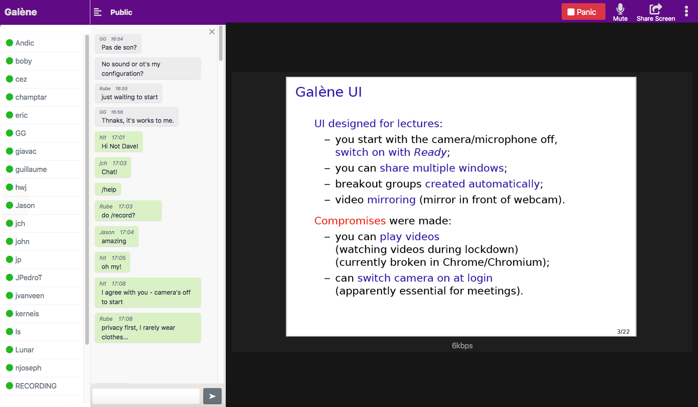

<!--
N.B.: Questo README è stato automaticamente generato da <https://github.com/YunoHost/apps/tree/master/tools/readme_generator>
NON DEVE essere modificato manualmente.
-->

# Galène per YunoHost

[](https://dash.yunohost.org/appci/app/galene)  

[](https://install-app.yunohost.org/?app=galene)

*[Leggi questo README in altre lingue.](./ALL_README.md)*

> *Questo pacchetto ti permette di installare Galène su un server YunoHost in modo semplice e veloce.*  
> *Se non hai YunoHost, consulta [la guida](https://yunohost.org/install) per imparare a installarlo.*

## Panoramica

Galène is a videoconference server (an “SFU”) that is easy to deploy and that requires moderate server resources. It was originally designed for lectures and conferences (where a single speaker streams audio and video to hundreds or thousands of users), but later evolved to be useful for student practicals (where users are divided into many small groups), and meetings (where a dozen users interact with each other).

### Client features:

- multiparty audio and video
- text chat
- reasonably good support for mobile (Android and iPhone/iPad)
- screen and window sharing, including sharing multiple windows simultaneously (not on mobile)
- streaming video and audio from disk
- activity detection
- LDAP support
- invite user
- Command-line client for Galene file transfer


**Versione pubblicata:** 0.8.1~ynh2

**Prova:** <https://galene.org:8443/>

## Screenshot



## Documentazione e risorse

- Sito web ufficiale dell’app: <https://galene.org/>
- Documentazione ufficiale per gli utenti: <https://galene.org/faq.html>
- Documentazione ufficiale per gli amministratori: <https://galene.org/>
- Repository upstream del codice dell’app: <https://github.com/jech/galene>
- Store di YunoHost: <https://apps.yunohost.org/app/galene>
- Segnala un problema: <https://github.com/YunoHost-Apps/galene_ynh/issues>

## Informazioni per sviluppatori

Si prega di inviare la tua pull request alla [branch di `testing`](https://github.com/YunoHost-Apps/galene_ynh/tree/testing).

Per provare la branch di `testing`, si prega di procedere in questo modo:

```bash
sudo yunohost app install https://github.com/YunoHost-Apps/galene_ynh/tree/testing --debug
o
sudo yunohost app upgrade galene -u https://github.com/YunoHost-Apps/galene_ynh/tree/testing --debug
```

**Maggiori informazioni riguardo il pacchetto di quest’app:** <https://yunohost.org/packaging_apps>
